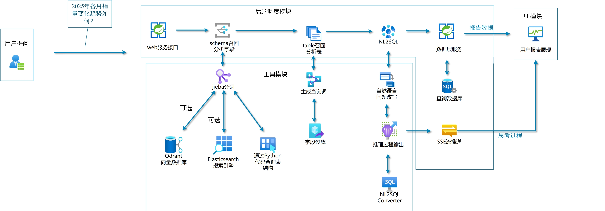

<div align='center'>
  <h1 style="margin-top: 15px;">「掌柜问数」智能数据分析 Agent</h1>
  <h4><b>shopkeeper-agent</b></h4>
  <p><em>一套真正能落地的企业级智能问数 Agent，配套系统性文字教程与对应章节分支，带你打通混合检索、多阶段推理、SQL 生成与执行全链路</em></p>
</div>

<div align='center'>


[](https://didilili.github.io/ai-agents-from-zero/#/%E5%AE%9E%E6%88%98%E9%A1%B9%E7%9B%AE-%E6%8E%8C%E6%9F%9C%E9%97%AE%E6%95%B0/0-%E5%89%8D%E8%A8%80)

</div>

**📢 说明**：本套实战项目还在积极更新中~~近期将更新完成。

---

项目以数据仓库元数据为中心，构建了一套基于大模型的企业级问数系统：先通过 **混合检索** 精准定位相关表、字段、指标和值域，再通过 **多阶段推理（Multi-stage Reasoning）** 组织上下文，最终生成并执行 SQL。

它不仅是一个“SQL 生成工具”，更接近一个会思考、会检索、会校验、会逐步推理的虚拟数据分析师。

> 本套仓库是 [ai-agents-from-zero](https://github.com/didilili/ai-agents-from-zero) 教程体系中的 [实战项目-掌柜问数](https://github.com/didilili/ai-agents-from-zero/tree/main/%E5%AE%9E%E6%88%98%E9%A1%B9%E7%9B%AE-%E6%8E%8C%E6%9F%9C%E9%97%AE%E6%95%B0) 配套源码仓库，除了可直接运行和二次开发的项目代码之外，也提供了与教程章节对应的 Git 分支演进过程，以及完整的在线图文讲义入口。
> 配套教程覆盖项目定位、技术架构、Agent 工作流与工程实践，适合结合章节分支一边阅读一边对照源码学习。
> 如果你想系统学习「AI智能体 大模型应用开发」，也可直接从系统教程 [AI 智能体实战速成指南-大模型入门](https://didilili.github.io/ai-agents-from-zero/#/) 开始。

## 📖 项目介绍

面对数以千计的数据表，传统 BI 往往很难满足“即时、自然、低门槛”的分析需求：

- 业务同学不会写 SQL
- 数据分析同学很难在短时间内摸清所有表结构和字段口径
- 单纯把问题直接丢给大模型，又容易出现字段选错、指标理解错、SQL 幻觉等问题

`掌柜问数` 要解决的就是这个问题：

- 用户用自然语言提问
- 系统自动召回相关字段、指标和字段取值
- 大模型基于上下文进行分步推理
- 生成 SQL 并查询数据仓库
- 以流式方式返回分析结果

当前后端围绕两条主线展开：

- **知识构建链路**：从数据仓库抽取元数据，构建 MySQL + Qdrant + Elasticsearch 组成的元数据知识库
- **查询执行链路**：围绕用户问题进行关键词扩展、混合召回、SQL 生成、校验、执行与流式返回

## 🏗️ 系统架构



## ✨ 项目亮点

- **检索 + 推理 + 生成，而不是模型直出 SQL**
    - 先围绕问题召回相关字段、指标和值域，再组织上下文生成 SQL，整体链路更稳、更可控。
- **面向企业问数场景的混合检索**
    - `Qdrant` 负责字段和指标的语义召回。
    - `Elasticsearch` 负责字段取值的全文检索。
    - `MySQL` 负责保存完整、权威的结构化元数据。
- **支持字段、指标、取值三类信息协同召回**
    - 比单纯做表级或字段级检索更贴近真实企业分析流程。
- **从检索到执行的完整可运行链路**
    - 不停留在 Prompt 设计，而是会真实生成 SQL、执行查询，并以流式方式返回结果。
- **工程化后端结构清晰**
    - 基于 `FastAPI + LangGraph + Repository + Client Manager` 组织配置、客户端、仓储层、服务层与智能体流程，便于维护和扩展。
- **不仅有实战代码，还有完整配套教程文档**
    - 项目配有一套系统化、持续更新、完全免费的教程讲义，适合按章节从数仓基础、元数据知识库到问数智能体流程逐步学习。
- **兼顾学习价值与可扩展性**
    - 既可以按教程章节逐步理解，也可以在此基础上继续扩展权限控制、SQL 审核、结果可视化等能力。

## 📚 配套教程目录

教程总入口：[掌柜问数完整教程](https://didilili.github.io/ai-agents-from-zero/#/%E5%AE%9E%E6%88%98%E9%A1%B9%E7%9B%AE-%E6%8E%8C%E6%9F%9C%E9%97%AE%E6%95%B0/0-%E5%89%8D%E8%A8%80)

下表把在线讲义、教程章节和本仓库的分支演进放到了一起，方便你一边看教程一边切换代码

| 章节 | 标题                                                                                                                                                                                                                                                                             | 简介                                                                                            | 对应分支                        |
| ---- | -------------------------------------------------------------------------------------------------------------------------------------------------------------------------------------------------------------------------------------------------------------------------------- | ----------------------------------------------------------------------------------------------- | ------------------------------- |
| 0    | [前言](https://didilili.github.io/ai-agents-from-zero/#/%E5%AE%9E%E6%88%98%E9%A1%B9%E7%9B%AE-%E6%8E%8C%E6%9F%9C%E9%97%AE%E6%95%B0/0-%E5%89%8D%E8%A8%80)                                                                                                                          | 介绍 NL2SQL 项目的目标边界、核心挑战，以及这套工程相对玩具 Demo 的技术定位                      | `-`                             |
| 1    | [项目概述与数仓基础](https://didilili.github.io/ai-agents-from-zero/#/%E5%AE%9E%E6%88%98%E9%A1%B9%E7%9B%AE-%E6%8E%8C%E6%9F%9C%E9%97%AE%E6%95%B0/1-%E9%A1%B9%E7%9B%AE%E6%A6%82%E8%BF%B0%E4%B8%8E%E6%95%B0%E4%BB%93%E5%9F%BA%E7%A1%80)                                             | 讲清业务库与数仓的区别、事实表与维度表建模，以及教学数仓为什么用 MySQL 模拟                     | `-`                             |
| 2    | [项目整体架构与智能体流程](https://didilili.github.io/ai-agents-from-zero/#/%E5%AE%9E%E6%88%98%E9%A1%B9%E7%9B%AE-%E6%8E%8C%E6%9F%9C%E9%97%AE%E6%95%B0/2-%E9%A1%B9%E7%9B%AE%E6%95%B4%E4%BD%93%E6%9E%B6%E6%9E%84%E4%B8%8E%E6%99%BA%E8%83%BD%E4%BD%93%E6%B5%81%E7%A8%8B)            | 从系统层面拆解 MySQL、Qdrant、Elasticsearch、LLM 与智能体工作流之间的协作关系                   | `-`                             |
| 3    | [开发环境与基础服务准备](https://didilili.github.io/ai-agents-from-zero/#/%E5%AE%9E%E6%88%98%E9%A1%B9%E7%9B%AE-%E6%8E%8C%E6%9F%9C%E9%97%AE%E6%95%B0/3-%E5%BC%80%E5%8F%91%E7%8E%AF%E5%A2%83%E4%B8%8E%E5%9F%BA%E7%A1%80%E6%9C%8D%E5%8A%A1%E5%87%86%E5%A4%87)                       | 介绍 `uv`、Docker Compose、MySQL、Qdrant、Elasticsearch、Kibana 和 Embedding 服务的本地准备方式 | `03-env-services`               |
| 4    | [项目结构与基础服务配置管理](https://didilili.github.io/ai-agents-from-zero/#/%E5%AE%9E%E6%88%98%E9%A1%B9%E7%9B%AE-%E6%8E%8C%E6%9F%9C%E9%97%AE%E6%95%B0/4-%E9%A1%B9%E7%9B%AE%E7%BB%93%E6%9E%84%E4%B8%8E%E5%9F%BA%E7%A1%80%E6%9C%8D%E5%8A%A1%E9%85%8D%E7%BD%AE%E7%AE%A1%E7%90%86) | 说明 `app` 分层结构、YAML 配置组织、`OmegaConf + dataclass` 的配置加载方案                      | `04-structure-config`           |
| 5    | [Qdrant 与 ES 快速入门与接入](https://didilili.github.io/ai-agents-from-zero/#/%E5%AE%9E%E6%88%98%E9%A1%B9%E7%9B%AE-%E6%8E%8C%E6%9F%9C%E9%97%AE%E6%95%B0/5-Qdrant%E4%B8%8EES%E5%BF%AB%E9%80%9F%E5%85%A5%E9%97%A8%E4%B8%8E%E6%8E%A5%E5%85%A5)                                     | 讲清向量检索与全文检索的职责边界，以及 `QdrantClientManager` 和 `ESClientManager` 的接入实现    | `05-qdrant-es`                  |
| 6    | [MySQL、Embedding 接入与日志管理](https://didilili.github.io/ai-agents-from-zero/#/%E5%AE%9E%E6%88%98%E9%A1%B9%E7%9B%AE-%E6%8E%8C%E6%9F%9C%E9%97%AE%E6%95%B0/6-MySQL%E3%80%81Embedding%E4%B8%8E%E6%97%A5%E5%BF%97%E7%AE%A1%E7%90%86)                                             | 介绍异步 MySQL 访问、TEI Embedding 接入，以及 `Loguru + request_id` 的日志链路设计              | `06-mysql-embedding-log`        |
| 7    | [元数据知识库总览与构建入口](https://didilili.github.io/ai-agents-from-zero/#/%E5%AE%9E%E6%88%98%E9%A1%B9%E7%9B%AE-%E6%8E%8C%E6%9F%9C%E9%97%AE%E6%95%B0/7-%E5%85%83%E6%95%B0%E6%8D%AE%E7%9F%A5%E8%AF%86%E5%BA%93%E6%80%BB%E8%A7%88%E4%B8%8E%E6%9E%84%E5%BB%BA%E5%85%A5%E5%8F%A3) | 总览元数据知识库的产物、存储分工，以及构建脚本如何通过配置驱动整条链路                          | `07-metadata-base-overview`     |
| 8    | [表与字段信息同步到元数据库](https://didilili.github.io/ai-agents-from-zero/#/%E5%AE%9E%E6%88%98%E9%A1%B9%E7%9B%AE-%E6%8E%8C%E6%9F%9C%E9%97%AE%E6%95%B0/8-%E8%A1%A8%E4%B8%8E%E5%AD%97%E6%AE%B5%E4%BF%A1%E6%81%AF%E5%90%8C%E6%AD%A5%E5%88%B0%E5%85%83%E6%95%B0%E6%8D%AE%E5%BA%93) | 聚焦 `Service + Repository + Mapper + ORM` 如何配合完成表字段元数据入库                         | `08-metadata-table-column-sync` |

## 🎯 你能学到什么

通过这个项目，你可以系统掌握下面这些内容：

- 一个企业级问数系统为什么不能只靠大模型裸写 SQL
- 元数据库、向量索引、全文索引分别应该存什么、怎么配合
- `Embedding -> Qdrant 召回 -> Elasticsearch 值检索 -> SQL 生成` 这条链路如何串起来
- `FastAPI + LangGraph + Repository + Client Manager` 如何组织成一个可维护的后端工程
- 如何把“教程里的知识点”真正落成一个能跑、能扩展的智能体后端

## 🛠️ 技术栈

- `Python`
    - 后端主语言，承载配置管理、元数据构建脚本、仓储层、服务层和智能体流程
- `FastAPI`
    - 后端接口框架，负责问数 API、请求解析和流式响应
- `LangGraph`
    - 智能体编排框架，组织检索、推理、SQL 生成、校验和执行流程
- `LangChain`
    - 模型接入层，封装 LLM 和 Embedding 调用并衔接 LangGraph 工作流
- `Qdrant`
    - 向量数据库，保存字段和指标的语义向量索引
- `Elasticsearch`
    - 全文检索引擎，保存字段真实取值索引
- `MySQL / SQLAlchemy`
    - `MySQL` 保存教学数仓和元数据，`SQLAlchemy` 负责异步连接、Session 管理和 ORM 映射
- `HuggingFace Text Embeddings Inference`
    - `TEI` Embedding 服务，把字段、指标和问题文本转成向量
- `Jieba`
    - 中文分词工具，用于关键词切分和检索前预处理
- `AsyncIO`
    - 异步运行时，支撑数据库、检索和 Embedding 调用并发执行
- `SSE`
    - 流式返回协议，用于实时推送执行过程和结果
- `Agentic Workflow`
    - 智能体式工作流，强调先检索、再推理、再生成、再执行

## 🚀 快速开始

当前仓库已经包含一套可直接启动的本地开发环境，推荐按下面的顺序启动项目。

### 1. 准备环境

- 推荐使用 `uv` 管理 Python 环境和依赖
- Python 版本要求：`>= 3.14`
- 本地需要安装 `Docker` 和 `Docker Compose`

### 2. 克隆项目

```bash
git clone https://github.com/didilili/shopkeeper-agent-backend.git
cd shopkeeper-agent-backend
```

### 3. 安装 Python 依赖

```bash
uv sync
```

如果你希望连开发依赖一起安装，可以使用：

```bash
uv sync --dev
```

### 4. 准备本地 Embedding 模型

项目里的 Embedding 服务通过 `TEI` 加载本地 `BAAI/bge-large-zh-v1.5` 模型目录

由于 `bge-large-zh-v1.5.zip` 体积较大，这个模型压缩包无法通过 Git 仓库提交，需要你先手动下载后放到本地目录

官方下载地址：https://huggingface.co/BAAI/bge-large-zh-v1.5

推荐直接下载到项目要求的挂载目录

```bash
uv run hf download BAAI/bge-large-zh-v1.5 --local-dir docker/embedding/bge-large-zh-v1.5
```

如果你是手动下载压缩包，也可以解压到下面这个目录

```bash
docker/embedding/bge-large-zh-v1.5
```

当前 [docker/docker-compose.yaml](docker/docker-compose.yaml) 会把这个目录挂载到容器内的 `/models/bge-large-zh-v1.5`

### 5. 启动基础服务

项目依赖的本地基础服务已经写在 [docker/docker-compose.yaml](docker/docker-compose.yaml) 里，包括：`MySQL`、`Elasticsearch`、`Kibana`、`Qdrant` 和 `Embedding`。

直接执行：

```bash
docker compose -f docker/docker-compose.yaml up -d
```

启动后默认端口如下：

- `MySQL`: `3306`
- `Elasticsearch`: `9200`
- `Kibana`: `5601`
- `Qdrant`: `6333`
- `Embedding`: `8081`

> `docker/mysql/meta.sql` 和 `docker/mysql/dw.sql` 会在 MySQL 容器首次启动时自动初始化元数据库和教学数仓数据

---

> 本仓库基于尚硅谷「大模型智能体线上速成班」实战项目补充完善
